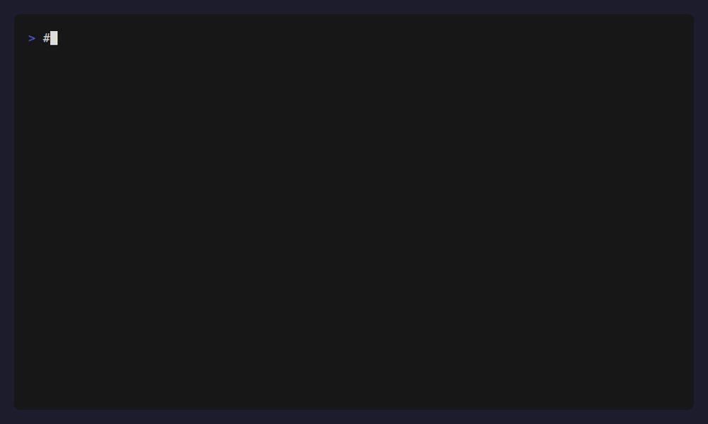

# :thread: stitch: the intent log for agents and humans



Stitch is a tool to help agents (and humans!) record their **intent** ("stitches") and bind it to **git commits/diffs**, forming an **intent DAG** that can't be represented by git's linear history or the textual representation of a diff.

Stitch helps you capture the "why" behind your code changes, creating a semantic layer on top of git that connects you and your agents' intentions to your implementations.

## Features

- **Intent Tracking**: Create and manage "stitches" - documents that capture the intent behind code changes
- **Git Integration**: Link stitches to commits, commit ranges, and staged diffs
- **DAG Relationships**: Build hierarchical relationships with parent/child stitches and dependencies
- **Stitch Blame**: See which intent is behind each line of code
- **MCP Server**: Expose stitch functionality to AI agents via the Model Context Protocol

## Installation

### Binary (Recommended)

** 
```bash
curl -fsSL https://raw.githubusercontent.com/captainsafia/stitch/main/scripts/install.sh | bash -s -- --preview
```

**Install CLI only**

```bash
curl -fsSL https://raw.githubusercontent.com/captainsafia/stitch/main/scripts/install.sh | bash -s -- --preview --cli-only
```

**Install MCP server only**

```bash
curl -fsSL https://raw.githubusercontent.com/captainsafia/stitch/main/scripts/install.sh | bash -s -- --preview --mcp-only
```

### Building from Source

```bash
git clone https://github.com/captainsafia/stitch.git
cd stitch
bun install
bun run compile
```

## Quick Start

```bash
# Initialize stitch in your repository
stitch init

# Start a new stitch session
stitch start "Implement user authentication"

# Work on your code, then link commits
git add .
git commit -m "Add login form"
stitch link --commit HEAD

# Create a child stitch for sub-tasks
stitch child "Add password validation"

# See stitch attribution for any file
stitch blame src/auth.ts
```

## Commands

### Session Management

#### `stitch init`

Initialize stitch in the current git repository. Creates the `.stitch/` directory structure.

#### `stitch start <title>`

Start a new stitch session with the given title. Sets this as the current stitch.

```bash
stitch start Implement user authentication
```

#### `stitch child <title>`

Create a child stitch under the current stitch. Useful for breaking down larger tasks.

```bash
stitch child "Add password validation"
```

#### `stitch switch <id>`

Switch to a different stitch by ID.

```bash
stitch switch S-20251228-3f2a
```

#### `stitch status`

Show the current stitch and its lineage (ancestor chain).

### Viewing Stitches

#### `stitch list [--status <status>]`

List all stitches, optionally filtered by status.

```bash
stitch list
stitch list --status open
stitch list --status closed
```

**Status options:** `open`, `closed`, `superseded`, `abandoned`

#### `stitch show <id>`

Show details of a specific stitch.

```bash
stitch show S-20251228-3f2a
```

#### `stitch edit [id]`

Open a stitch in your editor. Defaults to the current stitch.

```bash
stitch edit
stitch edit S-20251228-3f2a
```

### Linking to Git

#### `stitch link --commit <sha>`

Link a specific commit to the current stitch (or specify `--id`).

```bash
stitch link --commit HEAD
stitch link --commit abc1234
stitch link --commit HEAD --id S-20251228-3f2a
```

#### `stitch link --range <range>`

Link a commit range to the current stitch.

```bash
stitch link --range origin/main..HEAD
```

#### `stitch link --staged`

Create a fingerprint of the current staged diff and link it to the current stitch.

```bash
stitch link --staged
```

### Blame

#### `stitch blame <path> [--format plain|json]`

Show stitch attribution for each line in a file.

```bash
stitch blame src/auth.ts
stitch blame src/auth.ts --format json
```

## Stitch File Format

Stitches are stored as Markdown files with TOML frontmatter in `.stitch/stitches/`:

```markdown
+++
id = "S-20251228-3f2a"
title = "Implement user authentication"
status = "open"
created_at = "2025-12-28T22:41:00-08:00"
updated_at = "2025-12-28T22:41:00-08:00"
provenance = "human"
confidence = "medium"
tags = ["auth", "security"]

[relations]
parent = "S-20251228-aaaa"

[git]
links = [
  { kind = "commit", sha = "deadbeef..." },
]
+++

## Intent

Implement secure user authentication with session management.

## Constraints

- Must use bcrypt for password hashing
- Sessions expire after 24 hours

## Notes

Consider adding OAuth support in a future iteration.
```

## Library Usage

Stitch can also be used as a TypeScript library:

```typescript
import { StitchClient } from '@captainsafia/stitch';

const client = new StitchClient();

// Initialize and create stitches
await client.init();
const stitch = await client.start("My feature");

// Link commits
await client.linkCommit("abc1234");

// Get blame information
const blame = await client.blame("src/file.ts");
for (const line of blame) {
  console.log(`Line ${line.line}: ${line.stitchIds.join(", ") || "unstitched"}`);
}

client.close();
```

## MCP Server

Stitch includes an MCP (Model Context Protocol) server that allows AI agents to interact with stitch functionality programmatically. The MCP server exposes stateless, explicit tools that don't rely on "current stitch" state.

### Running the MCP Server

```bash
# Start the MCP server (stdio transport)
stitch-mcp
```

### Available Tools

| Tool | Description |
|------|-------------|
| `stitch_create` | Create a new stitch document |
| `stitch_get` | Get a stitch by ID |
| `stitch_list` | List stitches with optional filters |
| `stitch_update_frontmatter` | Update stitch metadata |
| `stitch_update_body` | Update stitch markdown body |
| `stitch_link_commit` | Link a commit to a stitch |
| `stitch_link_range` | Link a commit range to a stitch |
| `stitch_link_staged_diff` | Link staged diff fingerprint |
| `stitch_blame` | Get stitch attribution for file lines |

### Example Tool Usage

All tools require explicit `repoRoot` and `stitchId` parameters (no implicit state):

```json
{
  "tool": "stitch_create",
  "arguments": {
    "repoRoot": "/path/to/repo",
    "title": "Implement new feature"
  }
}
```

```json
{
  "tool": "stitch_link_commit",
  "arguments": {
    "repoRoot": "/path/to/repo",
    "stitchId": "S-20251228-3f2a",
    "sha": "abc1234"
  }
}
```

### Configuring with AI Agents

To use stitch-mcp with an MCP-compatible AI agent, add it to your agent's MCP server configuration:

```json
{
  "mcpServers": {
    "stitch": {
      "command": "stitch-mcp",
      "args": []
    }
  }
}
```

## Configuration

Stitch stores all data in your repository under `.stitch/`:

```
.stitch/
├── current          # Current stitch ID
└── stitches/        # Stitch documents
    └── S-YYYYMMDD-xxxx.md
```

**Environment Variables:**

- `EDITOR` or `VISUAL` - Editor for `stitch edit` command
- `DEBUG=1` - Enable debug output with stack traces

## Development

### Setup

```bash
git clone https://github.com/captainsafia/stitch.git
cd stitch
bun install
```

### Testing

```bash
bun test           # Run all tests
bun run typecheck  # Type checking
```

### Building

```bash
bun run build      # Build for npm distribution
bun run compile    # Compile standalone binary
```

## Contributing

Contributions are welcome! Please see [CONTRIBUTING.md](CONTRIBUTING.md) for development setup and guidelines.
